div.main-container {
  max-width: 1600px !important;
}

```{r setup, include=FALSE}
knitr::opts_chunk$set(echo = TRUE)
pacman::p_load(here, dplyr, ggplot2, lubridate, kableExtra)
```

# Learning Outcomes

By working on this module you should be able to 

- Differentiate long and short positions in the market
- Explain the price risk facing those long and short in the market
- Describe a textbook example of a short and long hedge
- Explain how different marketing scenarios use hedging as a price risk reduction tool ***?
- Describe the Iowa corn and ethanol pricing data
- Explain how profits are earned given different scenarios, with and without hedging

# Overview of this Module

Insert overview here

## Long and Short Positions in the Spot Market

In the spot market, a *long* position means you own unpriced commodity. You benefit if the spot price rises, and you lose if the spot price falls. An example of a 

A *short* position means you borrowed the commodity and immediately sold it, or something equivalent. You must eventually purchase the commodity and repay your loan. You benefit if the spot price falls, and you lose if the spot price rises. 

## Price Risk

Insert info here

## Textbook example of a short and long hedge

Figures \@ref(fig:text-shorthedge) and \@ref(fig:text-longhedge) are some [textbook](http://simpson.ca.uky.edu/files/cme-self_study_guide_to_futures_and_options.pdf) examples of short and long hedge.

:::: {.columns}
::: {.column width="50%"}
```{r text-shorthedge, echo=FALSE, fig.cap = "Short Hedge", fig.align='center', out.width = "80%"}
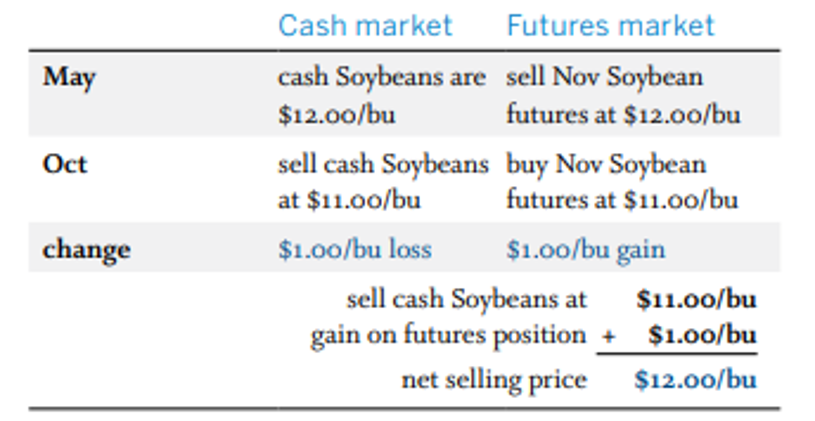
```
:::

::: {.column width="50%"}
```{r text-longhedge, echo=FALSE, fig.cap = "Long Hedge", fig.align='center', out.width = "80%"}
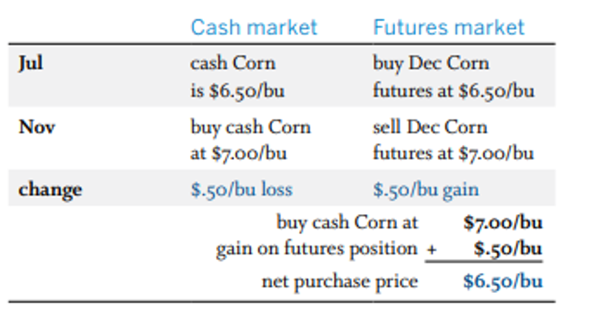
```
:::

::::

# Case Study: Corn and Ethanol in Iowa

We now look at three distinct scenarios in Iowa for the years 2016-2021 to examine the degree to which hedging reduces price risk. 
<!-- This format is only if you want 3 columns so that the picture will be on the right and the text is on the left, and a small empty column in the middle. -->

:::::::::::::: {.columns}
::: {.column width="50%"}
The [Mid Iowa Cooperative](https://www.midiowacoop.com/grains/cash-bids/) offers deferred delivery marketing contracts to local farmers. Figure \@ref(fig:beaman) on the right shows the cash bids when the contract is signed on November 20, 2021 and the months the delivery is allowed. The second row shows that the delivery is allowed anytime in January 2022. The -$0.25/bu basis is added to the Nov 20^th^ \$5.77/bu March futures price to get the price paid to farmer at \$5.52/bu, when the delivery is made.
:::

::: {.column width="5%"} 
<!-- This is just an empty column -->
:::

::: {.column width="40%"} 
```{r beaman, echo=FALSE, fig.cap = "Corn Cash Bid, Beaman", fig.align='center'}
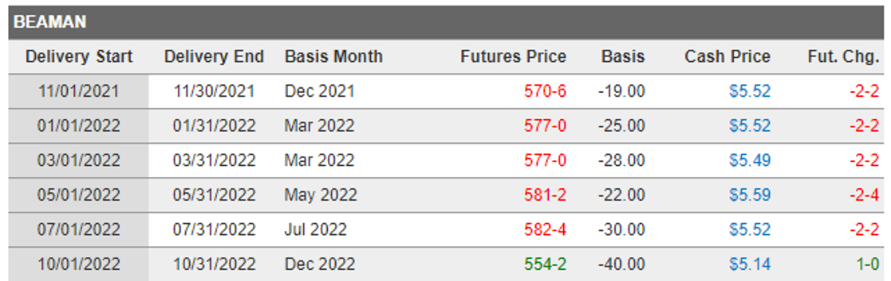
```
:::
::::

# Forward Export Sales

<!-- Option 1 for side by side. Different figure number but I can't figure out how to put Figure 3 in the middle of the box.  -->

<!-- Figure \@ref(fig:usda) shows the aggregate export sales of US. corn as of November 11, 2021. Much of the "new sales" for the week of November 11, 2021 are forward sales by firms locking in a sales price; in the coming weeks, these firms will purchase the corn and initiate the delivery process. -->

<!-- Figure \@ref(fig:exportbids) shows a graph of U.S. corn export bids relative to those of other countries. Data sourced [here](https://apps.fas.usda.gov/psdonline/circulars/grain.pdf). Exporters of U.S. corn must aggressively use forward sales to be competitive. These forward sales put exporters in a short position in the spot market. -->

<!-- :::: {.columns} -->

<!-- ::: {.column width="50%"} -->
<!-- ```{r usda, echo=FALSE, out.width="90%", fig.cap = "U.S. Export Sales as of November 11, 2021", fig.align='center'} -->
<!-- 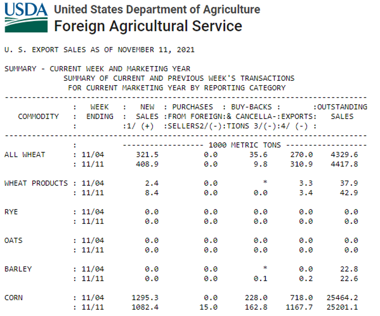 -->
<!-- ``` -->
<!-- ::: -->

<!-- ::: {.column width="50%"} -->

<!-- ```{r exportbids, echo=FALSE, out.width="80%", fig.cap = "Selected Export Bids, FOB", fig.align='center'} -->
<!-- 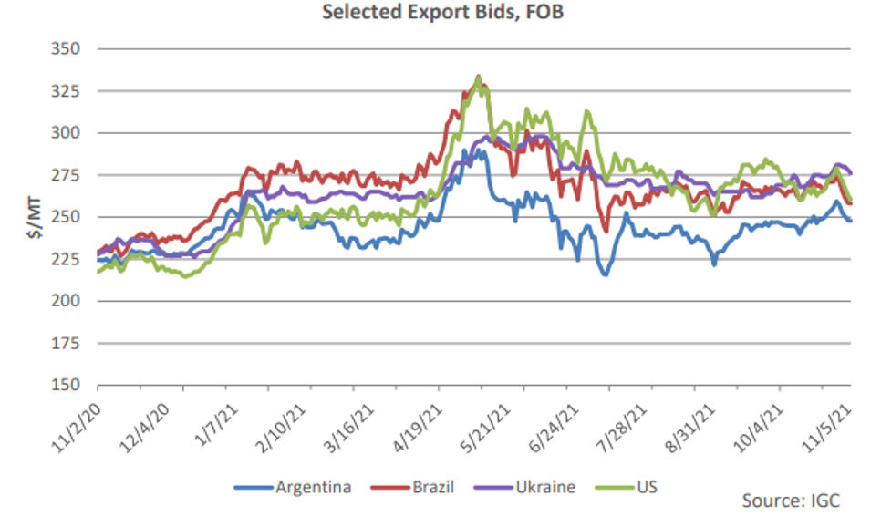 -->
<!-- ``` -->

<!-- ::: -->

<!-- :::: -->

The left panel of Figure \@ref(fig:figures-side2) shows the aggregate export sales of US. corn as of November 11, 2021. Much of the "new sales" for the week of November 11, 2021 are forward sales by firms locking in a sales price; in the coming weeks, these firms will purchase the corn and initiate the delivery process. The right panel of Figure \@ref(fig:figures-side2) shows a graph of U.S. corn export bids relative to those of other countries. Data sourced [here](https://apps.fas.usda.gov/psdonline/circulars/grain.pdf). Exporters of U.S. corn must aggressively use forward sales to be competitive. These forward sales put exporters in a short position in the spot market.

<!-- Option 2 (for side by side) but only 1 caption -->

```{r, figures-side2, fig.show="hold", out.width="50%", echo = F, fig.cap = "Forward Export Sales"}

par(mar = c(4, 4, .1, .1))
knitr::include_graphics(c("Images/usda.png", "Images/exportbids.png"))
```

## Case Study: Scenario 1

The first scenario we will look at is from the perspective of the Iowa Mid Cooperative who locks in a forward buy price with a local farmer. For example, referring to Figure \@ref(fig:beaman), if the farmer signs a deferred contract on November 20^th^ and agrees to deliver the price sometime in January 2022, the cooperative will pay the farmer \$5.52/bu when the farmer makes delivery, regardless of the spot price that day. The cooperative then sells the delivered grain at the current market spot price. This agreement exposes the Iowa Mid Cooperative to risk because of price fluctuations, as you can see from Figure \@ref(fig:cornspot). 

```{r cornspot, echo=FALSE, out.width="30%", fig.cap = "Weekly Corn Spot Price, Iowa", fig.align='center'}
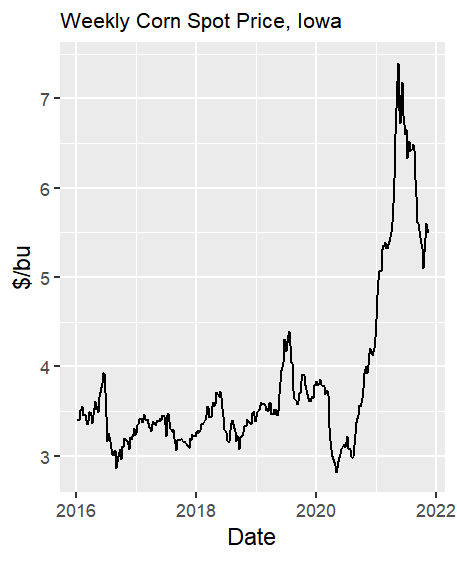
```

The Iowa Mid Cooperative can do a short hedge to manage their risk exposure. To determine the effectiveness of a short hedge, we choose an arbitrary week to serve as the forward contracting period and then choose a second arbitrary period 4-6 weeks ahead. The price in the second arbitrary period minus the price in the first arbitrary period is equal to the profits earned by the cooperative on the transaction.

We first divide the weekly data into five groups:

  - December, January, and February -> March Contract group
  - March, April -> May Contract group
  - May, June -> July Contract group
  - July, August -> September Contract group
  - September, October, November -> December contract group

This sub division ensures that when we later examine hedging scenarios, the forward contract and the delivery of the commodity take place in the same basis month. For example, a forward purchase in mid December and delivery in early February take place when the basis is calculated with the March contract. 

```{r, echo = F}
data <- read.csv(here("Data", "corn_ethanol_data.csv"), header=TRUE, sep=",", stringsAsFactors = FALSE) 
data$Date1 <- as.Date(data$Week, format = c("%m/%d/%Y")) 

profits <- readRDS(file = here("Code", "compare_KL.rds"))

# profits_data <- left_join(profits, data, by = c("Date1"))

profits <- profits %>%
  mutate(date_diff = as.numeric(profits$Date2 - profits$Date1),
         month = month(Date1),
         group = ifelse(month == 12 | month == 1 | month == 2, 1, 
                        ifelse(month == 3 | month == 4, 2, 
                               ifelse(month == 5 | month == 6, 3,
                                      ifelse(month == 7 | month == 8, 4, 5)))))
# average by contract group
avg_period <- profits %>%
  group_by(group) %>%
  summarise(avg_period = mean(date_diff/7, na.rm = T))
```

In other words, within each Contract group, we ask R to randomly pick a date X when the deferred contract is signed and another date Y to take delivery and sell the corn in the spot market. This process is done for each of the five groups and for each of the six years (2016-2011).  **Need to confirm: The average difference between the two dates is about `r round(mean(profits$date_diff/7), 2)`.**  Profits for the cooperative is the spot price on date Y minus the spot price on date X. Profits were simulated 300 times for each of the 30 subdivisions to ensure the law of large numbers. Figure \@ref(fig:long-corn) shows a histogram of the 9000 simulated profits. We repeat this process 300 times to ensure the law of large numbers. Codes for this simulation is provided in the Appendix. 

```{r long-corn, echo=FALSE, out.width="30%", fig.cap = "Profits, Long in Corn ($/bu)", fig.align='center'}
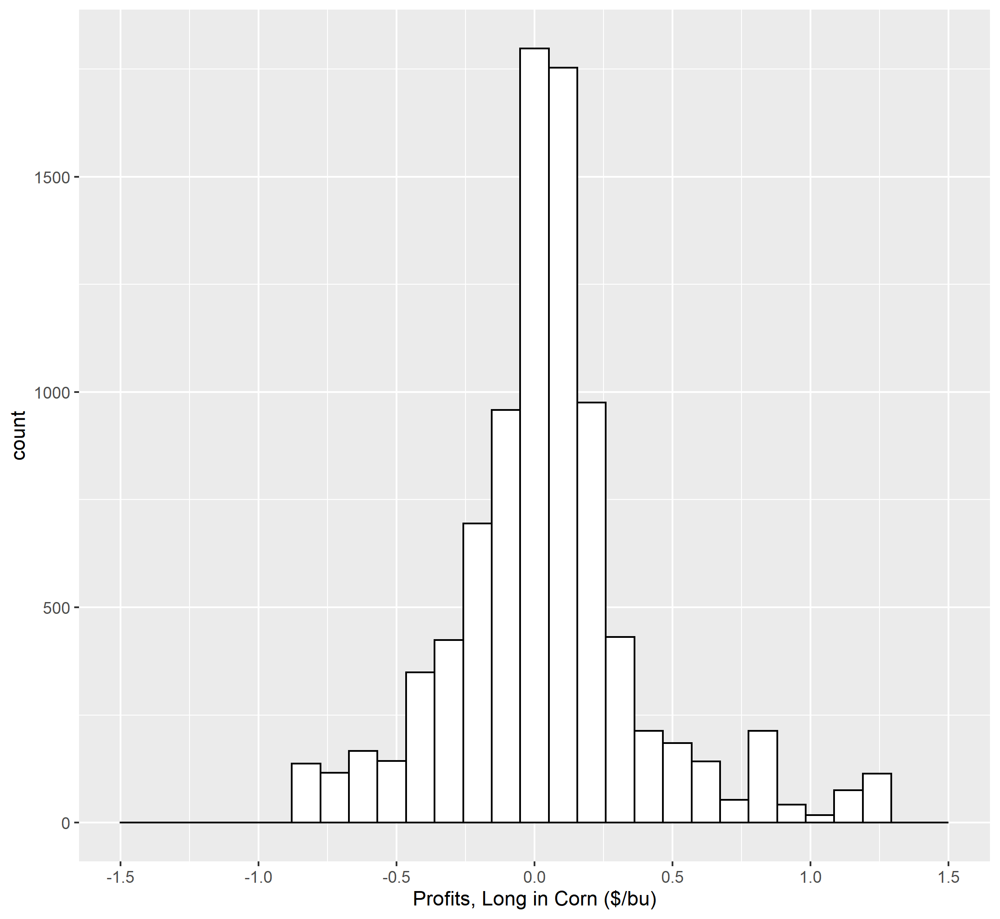
```

The price risk facing the cooperative who is long in the Iowa corn spot market for an average duration of `r round(mean(profits$date_diff/7), 2)` weeks is reflected by the left tail of the histogram. The following percentiles quantify this risk.

```{r, echo = F,}
# unname() removes the 5%, 10%, ..., 50%
# then i create a text vector containing these cutoffs
# so I can plot using kbl() since it will only plot horizontally if there are two rows
# if not, first col is the cutoffs, and second col is the values

long_spot_percentile <- round(quantile(profits$long_corn, probs = c(0.05,0.1,0.2,0.3,0.4,0.5)), 2)
long_spot_percentile <- unname(long_spot_percentile)

text <- c("5%", "10%", "20%", "30%", "40%", "50%")

perc1 <- rbind(text, long_spot_percentile)
rownames(perc1) <- c("", "Long Spot")
  
perc1 %>% 
  kbl() %>% 
  kable_styling() %>%
  row_spec(1, bold = TRUE) %>%  # bold first row since I'm manually creating this col name
  kable_paper("hover", full_width = F) # makes the table tighter, i.e. not occupy full row
```

We can interpret the percentiles as follows. The cooperative faces a 5% probability of losing more than \$0.56/bu. The cooperative faces a 10% probability of losing between \$0.18 and \$0.38/bu. The cooperative earns around \$0.04/bu on average but there is a sizeable price risk. 

To hedge against falling prices, the cooperative should:

  - Take a short position when the deferred delivery contract is signed.
  - Offset the short position when the farmer delivers the commodity and the cooperative sells it in the spot market. 
  
Losses on the spot market transaction are partially offset by gains in the futures market and vice versa. The same simulation procedure is used to generate 9000 occurences of combined spot market and future market profit outcomes. Figure \@ref(fig:short-hedge) shows the histogram of these profit outcomes.

```{r short-hedge, echo=FALSE, out.width="30%", fig.cap = "Profits, Short Hedge ($/bu)", fig.align='center'}
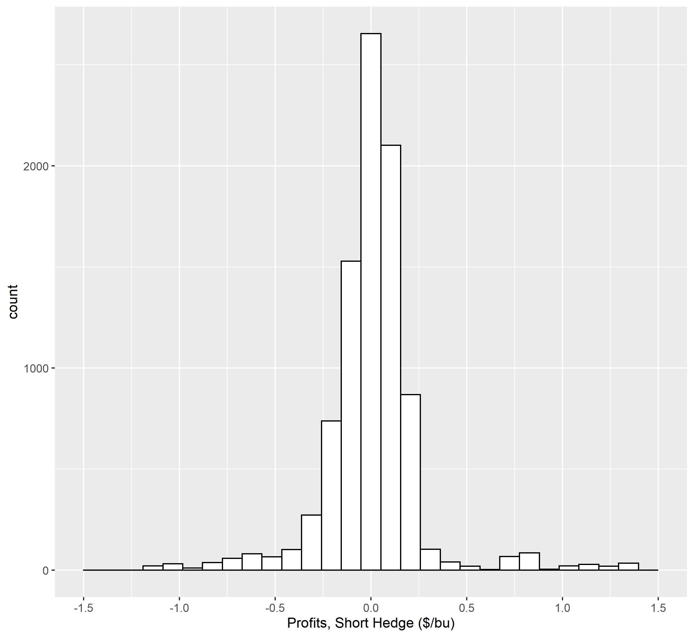
```

You can see that Figure \@ref(fig:short-hedge) has much thinner tails compared to Figure \@ref(fig:long-corn). The thinning of the left tail implies significantly lower risk. A comparison of the percentiles quantifies the difference in risk. The short hedge has signfiicantly reduced price risk in the left tail of the distribution. 

```{r, echo = F}
shorthedge_percentile <- round(quantile(profits$short_hedge, probs = c(0.05,0.1,0.2,0.3,0.4,0.5)), 2)
shorthedge_percentile <- unname(shorthedge_percentile)

perc2 <- rbind(text, long_spot_percentile, shorthedge_percentile)
rownames(perc2) <- c("", "Long Spot", "Short Hedge")

perc2 %>%
  kbl() %>%
  kable_styling() %>%
  row_spec(1, bold = TRUE) %>%  # bold first row since I'm manually creating this col name
  kable_paper("hover", full_width = F) # makes the table tighter, i.e. not occupy full row
```

In Figure \@ref(fig:overlay-deferred), we plot plot two profit histograms on one chart to better see the reduction in price risk. The red bars represent the profit distribution when the cooperative takes a long spot position. The blue bars represent the profit distribution when the cooperative tatkes a short hedge. The purple bars are the overlap between the profits in the long spot and short hedge positions. We can see that the the blue bars (short hedge) are lower than the red bars (long spot) at the tails, meaning there is less risk. Note that the hedge does not completely eliminate the risk. 

```{r overlay-deferred, echo=FALSE, out.width="30%", fig.cap = "Profits, Long Spot and Short Hedge ($/bu)", fig.align='center'}
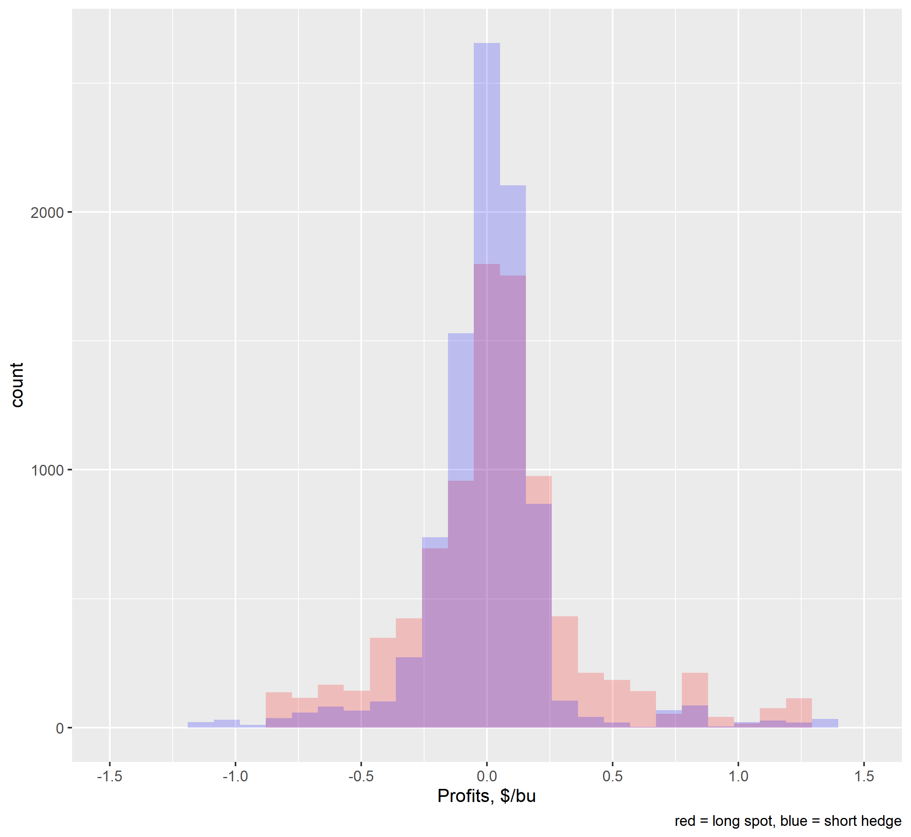
```

Figure \@ref(fig:basis-change)

```{r basis-change, echo=FALSE, out.width="30%", fig.cap = "Change in Basis over Hedging Period($/bu)", fig.align='center'}
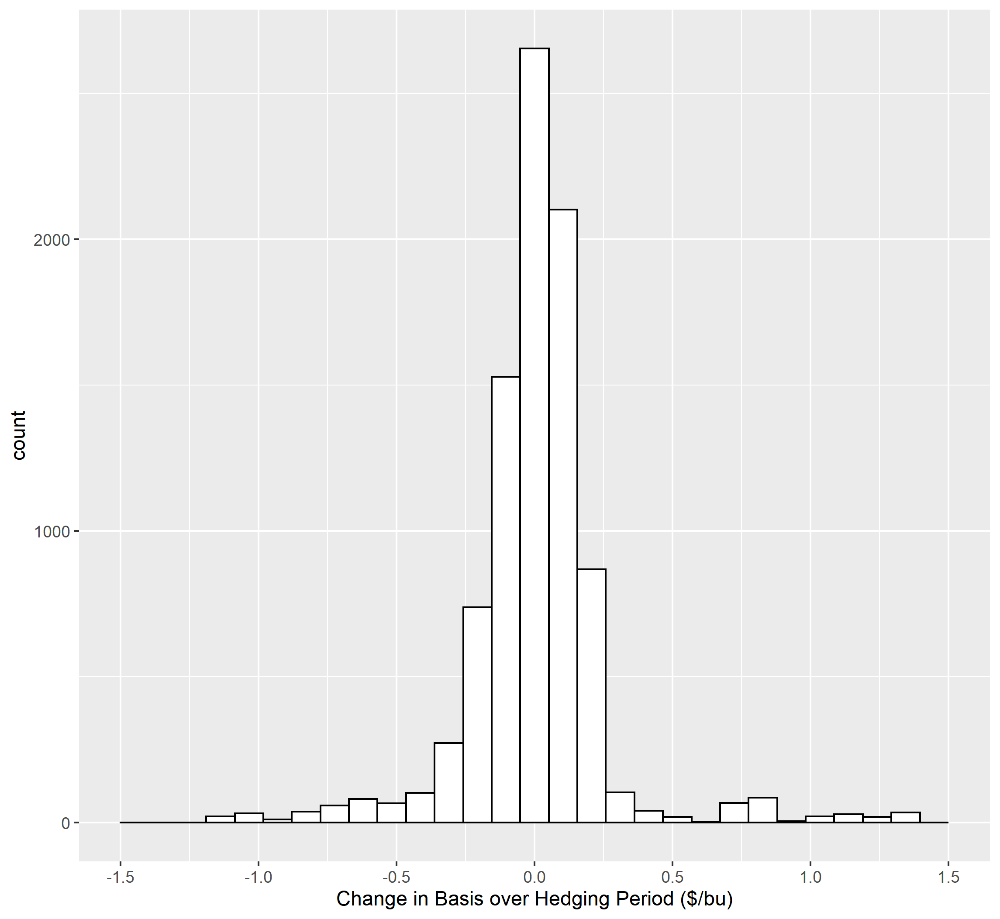
```

Here's the code if you want the two histogram and the overlay all side by side - Figure \@ref(fig:case1-side)

```{r, case1-side, fig.show="hold", out.width="30%", echo = F, fig.cap = "Profits ($/bu)", fig.align='center'}

par(mar = c(4, 4, .1, .1))
knitr::include_graphics(c("Images/hist_long_corn_scaled.png", "Images/hist_short_corn_scaled.png", "Images/overlay_deferred.png"))
```

## Case Study: Scenario 2

Optimal Hedging Ratio 

High Correlation but Different Std Dev

```{r hypothetical, echo=FALSE, out.width = "50%", fig.cap = "Hypothetical Spot, Futures, Basis", fig.align='center'}
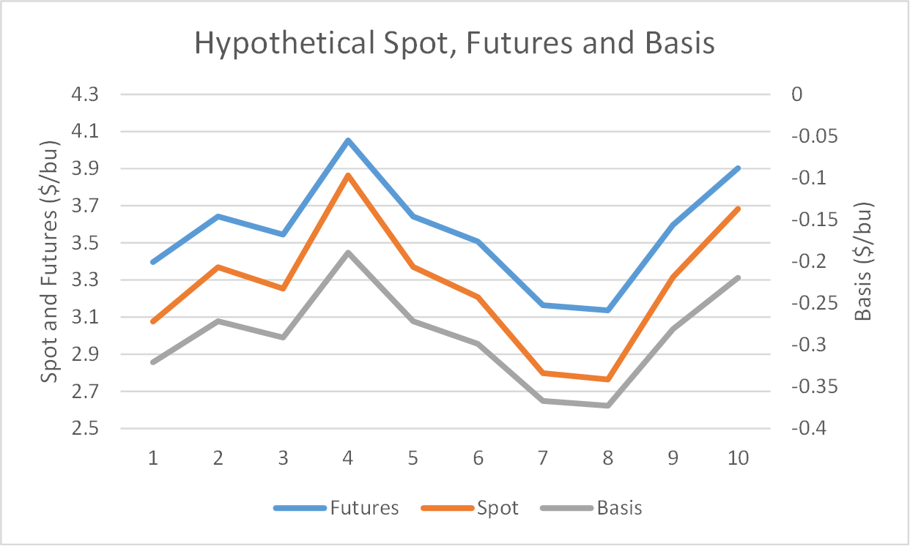
```


## Case Study: Scenario 3

We now examine three scenarios 

The weekly data is an aggregate for Iow, as reported in [here](https://www.extension.iastate.edu/agdm/energy/xls/agmrcethanolplantprices.xlsx). The spot price for corn was derived by adding the Iowa's corn basis, as reported by the USDA, to the prcie of the closest CME corn contract. The spot price of ethanol was derived by adding the Iowa's ethanol basis as reported by the USDA, to the price of the closest CME ethanol contract. The price of DDG (dried distillers grains) are based on feedlot payments. Of particular interest is the strength of the correlation between raw corn and DDG because both are highly substitutable as a livestock feed. The correlation between corn and DDG is approximately 0.75, which is relatively strong but still far from reflecting perfect substitutability. 

In the first scenario, the cooperative locks in a forward buy price with the farmer. When the farmer delivers the corn in a months time, the cooperative sells it at the current market spot price. Figure 
Figure \@ref(fig:figures-side) shows the spot prices of DDG, Ethanol, and Corn. 

```{r, figures-side, fig.show="hold", out.width="30%", echo = F, fig.cap = "Spot Prices", fig.align = 'center'}

par(mar = c(4, 4, .1, .1))
knitr::include_graphics(c("Images/DDG.png", "Images/Ethanol.png", "Images/CornSpot.png"))
```

Figure \@ref(fig:revcost) shows the revenue and cost in ethanol production. The blue line represents the sale of ethanol and DDG, and the red line represent the purchase of corn. The gap between these two lines is called the *crush margin* if all pricing is on the same day. One can also trade on the crush margin. **Read about the soybean crush [here](https://www.cmegroup.com/education/courses/introduction-to-agriculture/grains-oilseeds/understanding-soybean-crush.html) and check sobyean crush prices [here](https://www.barchart.com/futures/quotes/CS*0/futures-prices).**

```{r revcost, echo=FALSE, out.width = "50%", fig.cap = "Revenue and Cost in Ethanol Production", fig.align='center'}
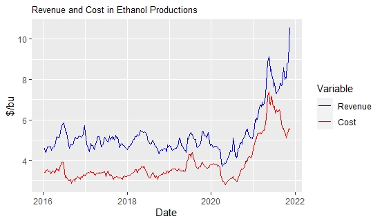
```

Figure \@ref(fig:nohedge-cm)

```{r nohedge-cm, echo=FALSE, out.width="30%", fig.cap = "Deviation from Target Crush Margin, No Hedge ($/bu)", fig.align='center'}
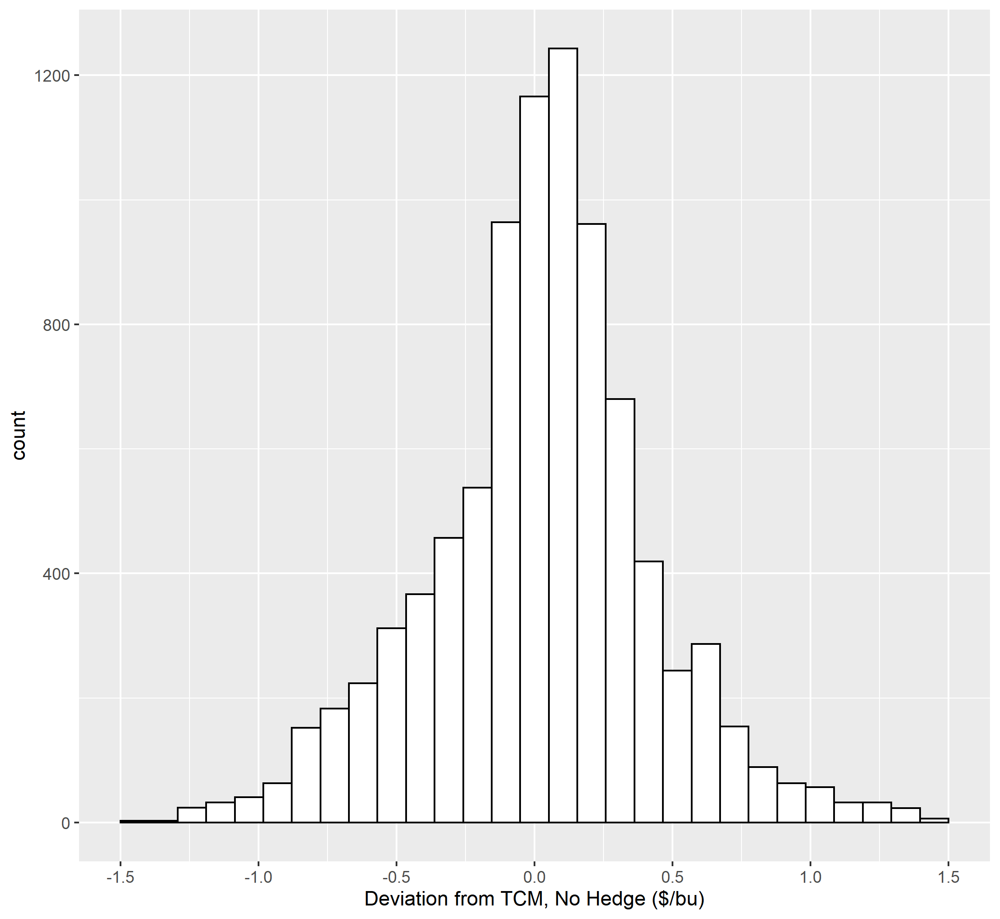
```

Figure \@ref(fig:hedge-cm)

```{r hedge-cm, echo=FALSE, out.width="30%", fig.cap = "Deviation from Target Crush Margin, Hedge ($/bu)", fig.align='center'}
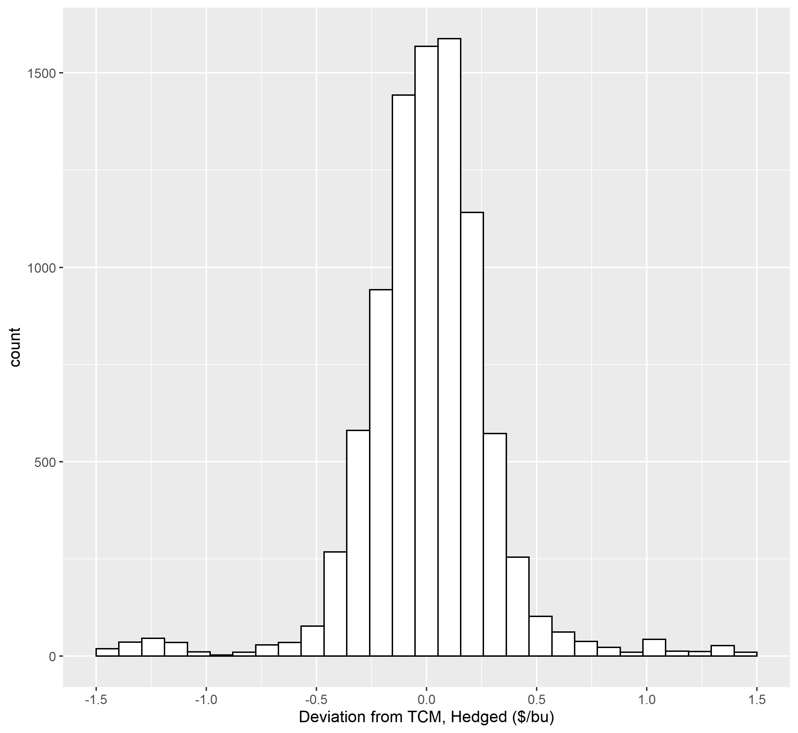
```

Figure \@ref(fig:overlay-cm) shows 

```{r overlay-cm, echo=FALSE, out.width="30%", fig.cap = "Deviation from Target Crush Margin, No Hedge and Hedged ($/bu)", fig.align='center'}
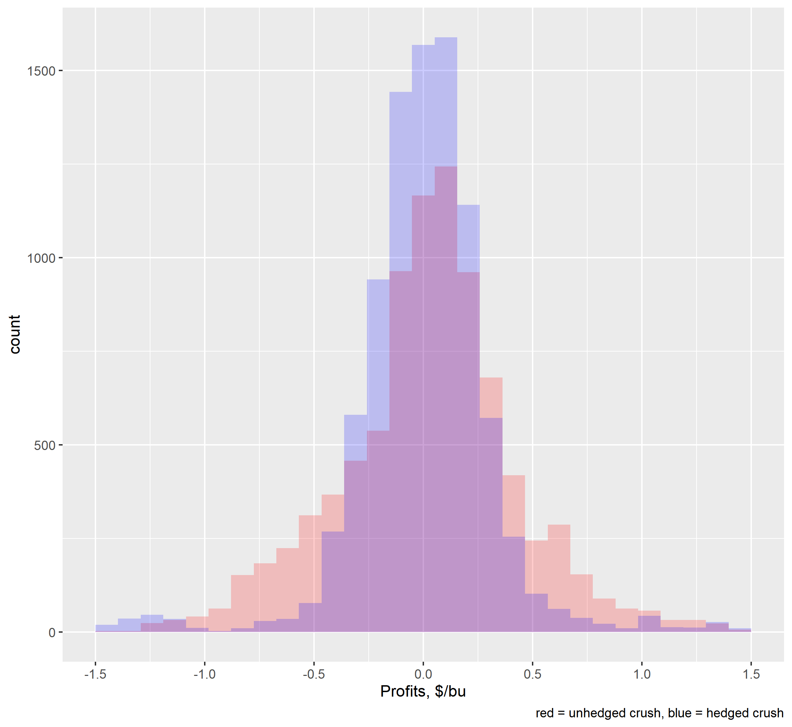
```

Here's the code if you want the two histogram and the overlay all side by side - Figure \@ref(fig:case3-side)

```{r, case3-side, fig.show="hold", out.width="30%", echo = F, fig.cap = "Profits ($/bu)", fig.align='center'}

par(mar = c(4, 4, .1, .1))
knitr::include_graphics(c("Images/hist_crush_nohedged_scaled.png", "Images/hist_crush_hedged_scaled.png", "Images/overlay_scaled.png"))
```

# Part B

# Short Hedging Profits

$(\tilde{P}_1 - P_0) + (F_0 - \tilde{F}_1)$

# Short Hedge with Farm Delivery at Date 0

Let $\tilde\omega_{0,1}$ be the carrying cost between dates 0 and 1, and let $\tilde\pi_{S}$ denote net short hedging profits for the cooperative. 

$$\tilde\pi_{S} = (\tilde{P}_1 - P_0) + (F_0 - \tilde{F}_1) - \tilde\omega_{0,1}$$

Rearranging the equation above, we get 

$$\tilde\pi_{S} = (\tilde{P}_1 - \tilde{F}_1) - (P_0 - F_0) - \tilde\omega_{0,1}$$
We can rewrite the above equation as $\tilde\pi_{S} = \tilde{B}_1 - B_0 - \tilde\omega_{0,1}$

Figure \@ref(fig:graph-shorthedge) shows that when the market is in equilibrium, the short hedger expects zero profits from the hedge. 

```{r graph-shorthedge, echo=FALSE, out.width="50%", fig.cap = "Deviation from Target Crush Margin, No Hedge and Hedged ($/bu)", fig.align='center'}
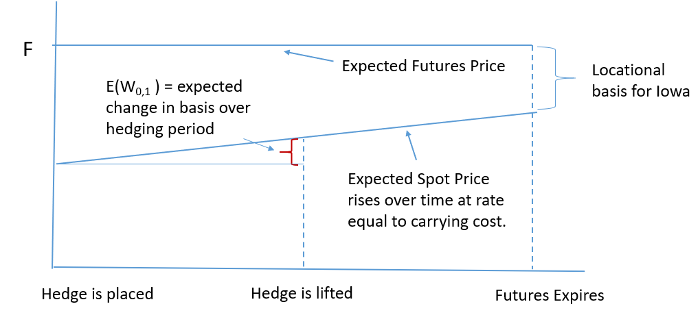
```


Figure \@ref(fig:graph-strongbasis) shows that expected hedging profits are lwer for the short hedger and higher for the long hedger if the initial basis is strong. 

```{r graph-strongbasis, echo=FALSE, out.width="50%", fig.cap = "Deviation from Target Crush Margin, No Hedge and Hedged ($/bu)", fig.align='center'}
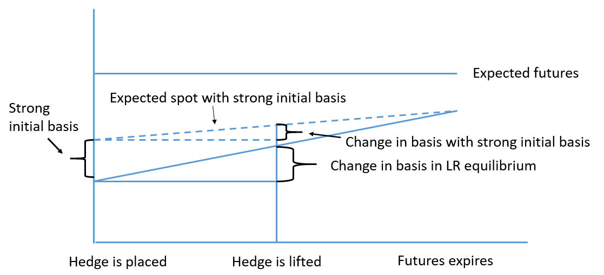
```


# Appendix - Simulations

```{r, eval = F}
data <- read.csv(here("Data", "corn_ethanol_data.csv"), header=TRUE, sep=",", stringsAsFactors = FALSE) 

# convert Week to date format
data$Week <- as.Date(data$Week, format = c("%m/%d/%Y"))

# setting the seed will ensure we can reproduce the random result
set.seed(2021) 

compare_repeat = list() # create the list which will hold the results to be saved

for (j in 1:300) {
for (i in 1:30) {
  sample <- data[sample(which(data$Index == i ), 3),] # random select three rows for each of 30 index values
  sample <- sample[order(sample$Week),] # order from oldest to newest
  sample <- as.data.frame(sample)
# construct single row which combines dates and prices from three rows.
  Date1 <- sample$Week[1]  
  Date2 <- sample$Week[2]
  Date3 <- sample$Week[3]
  DDG1 <- sample$DDG[1] # choose this and next four prices from first row
  Corn1 <- sample$CornSpot[1]
  Ethanol1 <- sample$Ethanol[1]
  FutCorn1 <- sample$CornFut[1]
  FutEthan1 <- sample$EthanFut[1]
  Corn2 <- sample$CornSpot[2] # choose this and next two prices from second row
  FutCorn2 <- sample$CornFut[2]
  FutEthan2 <- sample$EthanFut[2]
  Corn3 <- sample$CornSpot[3] # choose this and next three prices from third row
  FutCorn3 <- sample$CornFut[3]
  Ethanol3 <- sample$Ethanol[3]
  FutEthan3 <- sample$EthanFut[3]
  # bind previous variables into a single row
  # data.frame() instead of cbind() ensures date formats are preserved 
  sample3 <- data.frame(Date1, Date2, Date3, DDG1,Corn1,Ethanol1,FutCorn1,FutEthan1,Corn2,FutCorn2,Corn3,FutCorn3,Ethanol3,FutEthan3)
 
  # Construct the specific measures of hedging profits
  # Long in corn with no hedge: long_corn <- Buy corn[1] and sell corn[3]
  # Short in corn with no hedge: short_corn <- Sell corn[1] and buy corn[3]
  # Crush margin: crushNH <- Sell DDG[1], buy corn[2] and sell ethanol[3]
  # Short hedge: short_hedge <- Buy corn[1], short corn futures[1], sell corn[3] and long corn futures[3]
  # Long hedge: long_hedge <- Sell corn[1], long corn futures[1], buy corn[3] and short corn futures[3]
  # Crush hedge: crushH <- Sell DDG[1], long corn futures[1], short ethanol futures[1], buy corn[2], sell corn futures[2], sell ethanol[3] and long ethanol futures[3]
  
  compare <- sample3 %>% mutate(
    long_corn = -Corn1 + Corn3,
    short_corn = Corn1 - Corn3,
    crush1 = 0.0085*DDG1+2.8*Ethanol1-Corn1,
    crushNH = 0.0085*DDG1+2.8*Ethanol3-Corn2 - crush1,
    short_hedge = -Corn1 + Corn3 + FutCorn1/100 - FutCorn3/100,
    long_hedge = Corn1 - Corn3 - FutCorn1/100 + FutCorn3/100,
    crushH =  0.0085*DDG1+2.8*Ethanol3-Corn2 + 2.8*FutEthan1 - FutCorn1/100 + FutCorn2/100 - 2.8*FutEthan3 - crush1,
    cornBasis1 = Corn1 - FutCorn1/100,
    cornBasis2 = Corn2 - FutCorn2/100,
    cornBasis3 = Corn3 - FutCorn3/100,
    ethanolBasis1 = Ethanol1 - FutEthan1,
    ethanolBasis3 = Ethanol3 - FutEthan3,
    BasisChange = cornBasis3 - cornBasis1) %>%
    select(Date1, Date2, Date3, long_corn,short_corn,crushNH,short_hedge,long_hedge,crushH,cornBasis1,cornBasis2,cornBasis3,ethanolBasis1,ethanolBasis3, BasisChange)
    
  compare_repeat[[(j-1)*35+i]] <- compare  
}
}

compare_full <- dplyr::bind_rows(compare_repeat)
```